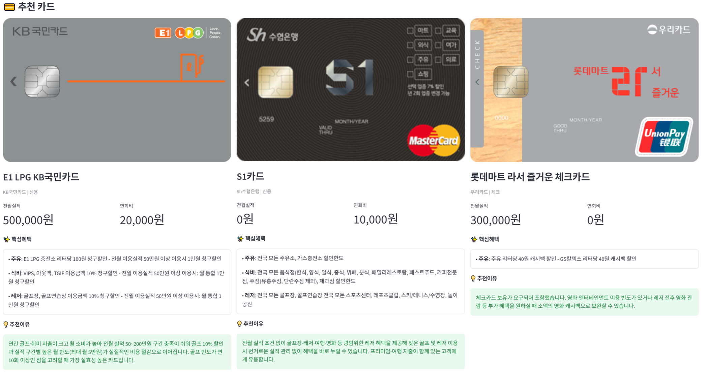

# AI 카드 추천 RAG 시스템

사용자의 세부 소비 패턴을 분석하여 적합한 신용/체크카드를 추천하는 **RAG 기반 AI 카드 추천 서비스**입니다.

카드 혜택 데이터를 문서 형태로 변환하고 ChromaDB에 저장한 뒤, 사용자 질문과 유사한 카드 후보를 검색합니다.  
검색된 카드 정보를 LLM context로 전달하여 카드명, 주요 혜택, 추천 이유를 생성합니다.

---

## 프로젝트 배경

개인의 소비 패턴은 학원비, 대중교통, 병원비, 해외여행, 주유, 카페, 쇼핑 등 다양합니다.  
하지만 카드 상품 수가 많고 혜택 조건이 복잡해 사용자가 자신에게 가장 적합한 카드를 직접 찾기 어렵다는 문제가 있습니다.

이를 해결하기 위해 사용자의 상황과 소비 패턴을 분석하고, 적합한 카드와 추천 사유를 함께 제공하는 맞춤형 AI 카드 추천 서비스를 기획했습니다.

---

## 팀 구성

- 4명

---

## 담당 역할

- 카드 혜택 데이터 전처리
- RAG용 document 및 metadata 구성
- ChromaDB 기반 벡터 검색 구현
- BM25와 Vector Search를 결합한 Hybrid Search 구현
- LLM 추천 이유 생성 프롬프트 설계
- 페르소나 기반 추천 결과 품질 비교

---

## 기술스택

- Python
- Streamlit
- Pandas
- OpenAI API
- LangChain
- ChromaDB
- BM25
- RAG
- Vector DB

---

## 주요 기능

### 데이터 수집 및 전처리

카드고릴라 웹사이트 크롤링을 통해 신용/체크카드 데이터를 수집하고, 카드명, 카드사, 카드 타입, 전월 실적, 연회비, 혜택 카테고리, 혜택 설명 등을 정리했습니다.

### RAG용 문서 생성

정형화된 카드 혜택 데이터를 LLM 검색에 적합한 문장형 document로 변환하고, 카드명·은행·카드 타입·혜택 카테고리·전월 실적·연회비 등을 metadata로 구성했습니다.

### Hybrid Search

사용자 질문과 추출된 소비 카테고리를 기반으로 ChromaDB Vector Search와 BM25 검색을 함께 사용했습니다.  
검색 결과는 RRF 방식으로 결합하여 관련도 높은 카드 후보를 추출했습니다.

### 조건 기반 필터링

사용자의 월 소비금액, 선호 카드 타입, 연회비 조건을 분석하고, 전월 실적 조건을 충족하지 못하는 카드는 추천 후보에서 제외했습니다.

### AI 추천 이유 생성

검색된 카드 정보를 LLM context로 전달하여 카드명, 주요 혜택, 추천 이유를 JSON 형태로 생성했습니다.  
단순 카드명 추천이 아니라 사용자의 소비 패턴과 카드 혜택이 왜 맞는지 설명하도록 구성했습니다.

### Streamlit 웹 서비스 구현

Streamlit을 활용하여 카드 추천 챗봇 UI를 구현했습니다.

- 사용자 입력 기반 카드 추천
- 페르소나 선택 기능
- 채팅 히스토리 관리
- 카드 이미지 표시
- 핵심 혜택 표시
- 추천 이유 출력
- 추천 과정 확인

---

## 결과 화면



---

## 실행 흐름

```txt
사용자 소비 패턴 입력
→ 카드 관련 질문 여부 판별
→ 소비 조건 추출
→ ChromaDB Vector Search
→ BM25 검색
→ Hybrid Search 결과 결합
→ 조건 기반 카드 필터링
→ LLM 추천 이유 생성
→ Streamlit UI 출력
```

---

## 프로젝트 구조

```txt
ai-card-recommendation-rag/
 ├─ app.py
 ├─ README.md
 ├─ requirements.txt
 ├─ .gitignore
 ├─ .env.sample
 ├─ chroma_db/
 ├─ data/
 └─ screenshots/
     └─ result_example.png
```

---

## 설치 및 실행

### 1. Repository clone

```bash
git clone https://github.com/gold3534-tech/ai-card-recommendation-rag.git
cd ai-card-recommendation-rag
```

### 2. 가상환경 생성 및 패키지 설치

```bash
python -m venv .venv
```

Windows:

```bash
.venv\Scripts\activate
```

macOS / Linux:

```bash
source .venv/bin/activate
```

패키지 설치:

```bash
pip install -r requirements.txt
```

### 3. 환경변수 설정

`.env.sample` 파일을 참고하여 `.env` 파일을 생성합니다.

```txt
OPENAI_API_KEY=your_openai_api_key
```

### 4. 실행

```bash
streamlit run app.py
```

---

## 평가 방식

추천 결과의 품질을 확인하기 위해 5가지 페르소나를 설계하고, 페르소나별 반복 테스트를 진행했습니다.

평가 기준은 다음과 같습니다.

- 소비 패턴 반영 여부
- 카드 혜택과 사용자 요구의 적합도
- 추천 이유의 논리성
- 응답 형식의 일관성
- 실제 사용자가 납득 가능한 추천인지 여부

---

## 배운 점

정형화된 카드 데이터를 RAG 검색에 적합한 문서 형태로 변환하고, Vector DB 검색 결과를 LLM 추천 응답으로 연결하는 흐름을 구현했습니다.

또한 단순 벡터 검색만 사용할 때 발생하는 관련성 문제를 보완하기 위해 BM25 기반 키워드 검색과 Vector Search를 결합한 Hybrid Search 방식을 적용했습니다.  
이를 통해 데이터 전처리, embedding, metadata 설계, 조건 기반 필터링, 프롬프트 엔지니어링, 추천 결과 평가 과정을 경험했습니다.

---

## 보안 주의사항

- `.env` 파일은 업로드하지 않습니다.
- OpenAI API Key는 코드에 직접 작성하지 않습니다.
- 실행 편의를 위해 ChromaDB 폴더를 포함했지만, 실제 서비스에서는 데이터 기반 재생성 스크립트로 관리하는 것이 적합합니다.